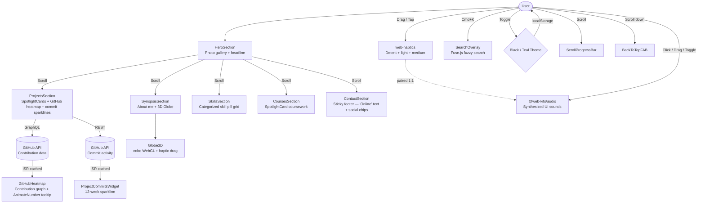

# *Portfolio Template* project

A config-driven developer portfolio built with **Next.js 16**, **Base UI**, **Tailwind CSS v4**, and **Motion**. Ships a polished single-page layout with photo gallery hero, interactive 3D globe, GitHub contribution heatmap, and fuzzy search; all controlled from one config file.

## Architecture



## Features

- **Config-driven** Edit a single `portfolio.config.ts`
- **Photo gallery hero** Desktop fanned layout with spring arc tooltip labels; mobile swipeable card stack; staggered entrance animations
- **Interactive 3D globe** `cobe` WebGL globe in the about section with drag rotation and haptic detents (picks up every ~15° like a scroll wheel)
- **GitHub heatmap** Contribution graph with year navigation, `AnimateNumber` digit-flip tooltips, physical stagger entrance (distance-based spring ripple from top-left), and skillicons.dev GitHub brand icon; fetched from GitHub GraphQL API with ISR caching; placeholder fallback when no token is set
- **Fuzzy search overlay** Cmd+K / Ctrl+K triggers Fuse.js-powered search across all sections with action links; tags indexed separately from display text
- **Project commit sparklines** Per-project GitHub commit activity for the last 12 weeks
- **2 color themes** Black and Teal, switchable via chip-style text button with opacity crossfade and diagonal wipe page transition (View Transitions API + clip-path, 350ms); flash-free hydration via anti-FOUC inline script
- **Scroll progress bar** + **Back-to-top FAB** toggleable via feature flags
- **Categorized skill pills** Tech stack displayed as a categorized grid of theme-aware pills with hover effects and skillicons.dev CDN icons; inline stack description paragraph with embedded pill buttons; squircle corners via `@lisse/react` smoothCorners
- **Sticky footer contact** Pure CSS sticky reveal content sections scroll over with `z-10` while the Contact section sits at `z-0`, pinned to the viewport bottom; decorative "God bless you." branding text at the bottom edge
- **SpotlightCard** Project and coursework cards with a radial-gradient glow that follows the cursor, theme-aware accent color
- **Shadow elevation** Two-tier depth system: `dm-elevation-2` for dark sections and 3-layer stacked shadow `elevation-2` for light sections
- **Variant-aware typography** `SectionWrapper` provides a React context so `Overline` and `SectionHeading` automatically adapt their color to dark/light backgrounds, ensuring WCAG AA contrast compliance on every section
- **Chip-style buttons** Squircle-corned (`@lisse/react`) interactive chips for nav, contact, and back-to-top; animated rainbow glow ring on search overlay trigger; colors adapt to the active theme
- **Web haptics** Touch feedback on chips, drags, globe rotation and button taps
- **Synthesized audio** Dual-channel haptic+sound feedback on every interaction; ultra-subtle sine-wave tones from `@web-kits/audio` Minimal patch (9 sounds across 10 components); auto-respects `prefers-reduced-motion`
- **Themed scrollbar** Thin accent-colored scrollbar consistent across all scroll containers
- **Map pin avatars** SVG map pin markers on the globe with embedded photos and counter-rotation tilt during drag
- **Motion-optimized** Full-project animation audit — 83% of 28 animations are S or A-tier; zero layout thrashing; standardized hover easing (ease-out-cubic) across Chip, ShowMoreButton, and TagPill for consistent micro-interaction feel; theme crossfade tuned to 350ms (within Emil's 400ms page-transition ceiling)
- **Accessible** Skip-to-content link, semantic HTML, keyboard navigation, `prefers-reduced-motion` support; dark-section overline contrast passes WCAG AA (4.58:1)
- **SEO** Open Graph tags, JSON-LD Person schema, semantic heading hierarchy
- **Performance** Static generation, Geist font family via `next/font` for zero-FOUT, Tailwind v4

## Tech Stack

```mermaid
graph TD
    subgraph Framework
        NEXT["Next.js 16<br/>App Router + React 19"]
    end

    subgraph Styling
        TW["Tailwind CSS v4<br/>Zero runtime"]
        BASEUI["Base UI v1.x<br/>Unstyled primitives"]
    end

    subgraph Animation
        FM["Motion 12<br/>motion/react + motion"] 
        FMP["Motion Plus<br/>AnimateNumber digit-flip"]
    end

    subgraph Data
        FUSE["Fuse.js<br/>Fuzzy search"]
        GHAPI["GitHub GraphQL API<br/>Contribution heatmap"]
        GHREST["GitHub REST API<br/>Commit activity"]
    end

    subgraph Fonts
        GEIST["Geist<br/>Sans + Mono + Pixel families"]
    end

    subgraph Icons
        RI["react-icons<br/>Feather set"]
        SKILL["skillicons.dev<br/>Brand & skill icons"]
    end

    subgraph Haptics
        WH["web-haptics<br/>Touch feedback"]
    end

    subgraph Audio
        WKA["@web-kits/audio<br/>Declarative Web Audio synthesis"]
    end

    subgraph Globe
        COBE["COBE<br/>WebGL globe renderer"]
    end

    NEXT --> TW
    NEXT --> BASEUI
    NEXT --> FM
    NEXT --> FMP
    NEXT --> FUSE
    NEXT --> GHAPI
    NEXT --> GHREST
    NEXT --> GEIST
    NEXT --> RI
    NEXT --> WH
    NEXT --> WKA
    NEXT --> COBE
```



| Dependency | Purpose |
|---|---|
| [Next.js 16](https://nextjs.org/) | App Router framework with React 19 |
| [Base UI](https://base-ui.com/) | Unstyled, accessible UI primitives |
| [Tailwind CSS v4](https://tailwindcss.com/) | Utility-first styling |
| [Motion 12](https://motion.dev/) | Spring animations from `motion/react` + `motion` for vanilla scroll utility |
| [Motion Plus](https://motion.dev/) | `AnimateNumber` for animated digit-flip counters |
| [Fuse.js](https://www.fusejs.io/) | Client-side fuzzy search |
| [Geist](https://vercel.com/font) | Sans, Mono, and Pixel font families via the `geist` package |
| [react-icons](https://react-icons.github.io/react-icons/) | Feather (Fi) icons for navigation arrows and search |
| [skillicons.dev](https://skillicons.dev/) | CDN brand icons for skill pills, theme toggle, and GitHub logo |
| [web-haptics](https://haptics.lochie.me/) | Touch haptic feedback |
| [@web-kits/audio](https://audio.raphaelsalaja.com/) | Declarative Web Audio synthesis for UI sound feedback |
| [COBE](https://cobe.vercel.app/) | WebGL globe renderer |
| [@lisse/react](https://www.npmjs.com/package/@lisse/react) | Figma-style squircle corners (Chip, ThemeToggle, SpotlightCard, CardStack) |
| [Paper Shaders](https://shaders.paper.design/) | WebGL fluted glass background effect |
| Vercel | Recommended hosting with ISR support |

## <a name="credits">Acknowledgment</a>

This project would not be possible without the following open-source projects:

- Haptic feedback from [web-haptics](https://haptics.lochie.me/)
- UI sound synthesis from [@web-kits/audio](https://audio.raphaelsalaja.com/)
- Fuzzy search from [Fuse.js](https://www.fusejs.io/)
- Accessible UI primitives from [Base UI](https://base-ui.com/)
- Clipped WebGL globe card aesthetic from [COBE](https://cobe.vercel.app/)
- Theme toggle effect from [theme-toggle.rdsx.dev](https://theme-toggle.rdsx.dev/) using View Transition API

This project has been inspired by the following websites and designs:

- [braydoncoyer.dev](https://www.braydoncoyer.dev/): hero section gallery images display with spring-animated photo fan-out
- [anirudhkuppili.com](https://anirudhkuppili.com): layout structure, section hierarchy, color theming system, and overall visual language
- [Aceternity UI](https://ui.aceternity.com/): `ArcTooltip` animated tooltip pattern, and `SpotlightCard` cursor-following radial gradient


## Quick Start

```bash
# Clone
git clone <your-repo-url> my-portfolio
cd my-portfolio

# Install
npm install

# Configure edit with your info
# src/config/portfolio.config.ts

# Dev
npm run dev

# Build
npm run build
```

## Configuration

All content lives in [`src/config/portfolio.config.ts`](src/config/portfolio.config.ts).

| Section | Description |
|---|---|
| `meta` | Name, title, headline, description, production URL (`siteUrl`), OG image |
| `themes` | Black and Teal color definitions, default theme |
| `nav` | Navigation links (supports `external` and `download` flags) |
| `hero` | Desktop photo positions + mobile photo list |
| `sections.*` | Each section has `enabled: boolean` + content data (Contact: sticky footer outside content z-10 wrapper) |
| `features` | Toggle search overlay, scroll progress, back-to-top, GitHub heatmap |

### GitHub Heatmap

To display real contribution data, create a `.env.local` file:

```
GITHUB_TOKEN=ghp_your_personal_access_token
```

The token needs the `read:user` scope. Without a token, a placeholder heatmap is displayed.

### Images

Place images in the `public/` directory:

```
public/
├── photos/          # Hero gallery photos
├── og.png           # Open Graph image (1200×630 recommended)
├── resume.pdf       # Downloadable resume
└── favicon.ico
```

Hero photos use `next/image` with `fill` layout for native lazy loading and zero layout shift.

## Project Structure

```
.
├── src/
│   ├── app/
│   │   ├── layout.tsx              # Root layout, fonts, theme init, JSON-LD, metadata API
│   │   ├── page.tsx                # Single page: conditionally renders sections from config
│   │   ├── robots.ts               # robots.txt metadata route
│   │   ├── sitemap.ts              # sitemap.xml metadata route
│   │   └── globals.css             # Tailwind v4 + CSS custom properties + scrollbar
│   ├── components/
│   │   ├── providers/
│   │   │   ├── AudioProvider.tsx     # Audio context + localStorage persistence
│   │   │   ├── ThemeProvider.tsx     # Theme context + localStorage sync
│   │   │   └── ThemeScript.tsx       # Inline script for flash-free theme init
│   │   ├── sections/
│   │   │   ├── HeroSection.tsx                 # Photo gallery + headline + stagger entrance
│   │   │   ├── SynopsisSection.tsx             # About + GitHub heatmap + globe
│   │   │   ├── ProjectsSection.tsx             # SpotlightCard project cards (dark)
│   │   │   ├── SkillsSection.tsx               # Categorized pill grid with skillicons.dev CDN
│   │   │   ├── CoursesSection.tsx              # SpotlightCard coursework (dark)
│   │   │   ├── CourseShowMoreClient.tsx        # Client expand/collapse with staggered entrance
│   │   │   └── ContactSection.tsx              # Social link Chips with react-icons
│   │   └── ui/
│   │       ├── ArcTooltip.tsx           # Spring-animated arc tooltip for photo labels
│   │       ├── BackToTopFAB.tsx         # Keycap-styled floating action button
│   │       ├── CardStack.tsx            # Mobile: swipeable photo card stack with 3D tilt
│   │       ├── Chip.tsx                 # Tag / link chip (squircle corners + dm-elevation-2)
│   │       ├── FlutedGlassBackground.tsx # Background image (ContactSection)
│   │       ├── GitHubHeatmap.tsx        # Contribution graph (theme-aware SVG + AnimateNumber tooltip)
│   │       ├── Globe3D.tsx              # cobe WebGL interactive globe with haptic drag detents
│   │       ├── GlobeCard.tsx            # Clipped globe card wrapper (dynamic import + skeleton)
│   │       ├── MapPinAvatar.tsx         # SVG map pin marker with embedded photo
│   │       ├── Photo.tsx                # Single draggable photo with ArcTooltip
│   │       ├── PhotoGallery.tsx         # Desktop: staggered spring photo fan-out
│   │       ├── ProjectCommitsWidget.tsx # Per-project GitHub commit sparkline
│   │       ├── ScrollProgressBar.tsx    # Fixed top scroll indicator
│   │       ├── SearchOverlay.tsx        # Cmd+K fuzzy search (Fuse.js + Base UI Dialog)
│   │       ├── SectionWrapper.tsx       # Shared section layout (dark / light variants, no animation)
│   │       ├── ShowMoreButton.tsx       # Expand/collapse toggle button
│   │       ├── SpotlightCard.tsx        # Polymorphic card with cursor-following radial glow
│   │       ├── StaggeredBlurText.tsx    # Staggered word-by-word blur entrance animation
│   │       └── ThemeToggle.tsx          # Theme switcher: chip-style text button + View Transitions API vertical wipe
│   ├── config/
│   │   └── portfolio.config.ts     # Single-file site configuration
│   ├── lib/
│   |   ├── clock.ts               # Realtime clock helpers
│   |   ├── color.ts               # Color manipulation utilities
│   |   ├── github.ts              # GitHub GraphQL client (ISR cached)
│   |   ├── scroll.ts              # Spring-animated scroll utilities
│   |   └── search.ts              # Fuse.js search index builder
│   ├── types/
│   │   └── config.ts               # TypeScript config interfaces
├── lib/
│   └── audio/
│       ├── index.ts               # @web-kits/audio generated patch
│       └── minimal.ts             # Minimal audio patch reference
└── public/
    ├── photos/                     # Hero gallery images
    ├── og.png                      # Open Graph image (1200×630)
    └── resume.pdf                  # Downloadable resume
```

## Deployment

Deploy to Vercel:

```bash
npx vercel
```

Or build and serve statically:

```bash
npm run build
npm start
```

## License

MIT
