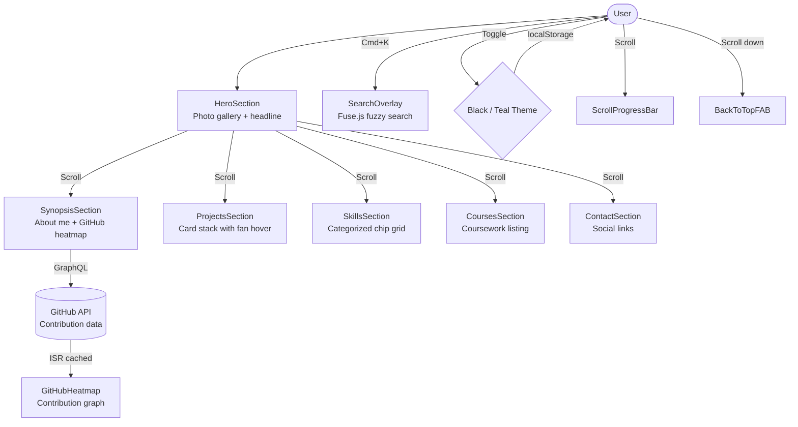
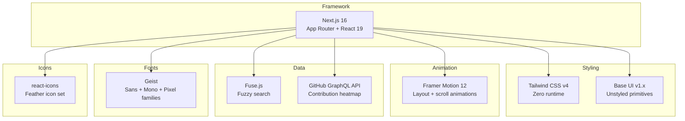

# *Portfolio Template* project

A config-driven developer portfolio built with **Next.js 16**, **Base UI**, **Tailwind CSS v4**, and **Framer Motion**. Ships a polished single-page layout with photo gallery hero, GitHub contribution heatmap, and fuzzy search; All controlled from one config file.

## Architecture



## Features

- **Config-driven** Edit a single `portfolio.config.ts`
- **Photo gallery hero** Desktop fanned layout with arc tooltip labels; mobile swipeable card stack; staggered entrance animations
- **GitHub heatmap** Contribution graph fetched from GitHub GraphQL API with ISR caching; placeholder fallback when no token is set
- **Fuzzy search overlay** Cmd+K / Ctrl+K triggers Fuse.js-powered search across all sections with action links
- **2 color themes** Black and Teal, switchable at runtime with `localStorage` persistence and flash-free hydration
- **Scroll progress bar** + **Back-to-top FAB** toggleable via feature flags
- **Card stack fan** Project cards with hover fan-out interaction
- **Keycap buttons** Skeuomorphic keyboard-key style for the search trigger, hero nav chips, and back-to-top FAB; colors adapt to the active theme
- **Accessible** Skip-to-content link, semantic HTML, keyboard navigation, `prefers-reduced-motion` support
- **SEO** Open Graph tags, JSON-LD Person schema, semantic heading hierarchy
- **Performance** Static generation, Geist font family via `next/font` for zero-FOUT, Tailwind v4 (zero runtime CSS)

## Tech Stack



| Dependency | Purpose |
|---|---|
| [Next.js 16](https://nextjs.org/) | App Router framework with React 19 |
| [Base UI](https://base-ui.com/) | Unstyled, accessible UI primitives |
| [Tailwind CSS v4](https://tailwindcss.com/) | Utility-first styling |
| [Framer Motion 12](https://motion.dev/) | Layout animations, staggered entrances, scroll-driven effects |
| [Fuse.js](https://www.fusejs.io/) | Client-side fuzzy search |
| [Geist](https://vercel.com/font) | Sans, Mono, and Pixel font families via `next/font` |
| [react-icons](https://react-icons.github.io/react-icons/) | Icon library |
| [sharp](https://sharp.pixelplumbing.com/) | Image optimization at build time |
| Vercel | Recommended hosting with ISR support |

## Quick Start

```bash
# Clone
git clone <your-repo-url> my-portfolio
cd my-portfolio

# Install
npm install

# Configure — edit with your info
# src/config/portfolio.config.ts

# Dev
npm run dev

# Build
npm run build
```

## Configuration

All content lives in [`src/config/portfolio.config.ts`](src/config/portfolio.config.ts).

| Section | Description |
|---|---|
| `meta` | Name, title, headline, description, OG image |
| `themes` | Black and Teal color definitions, default theme |
| `nav` | Navigation links (supports `external` and `download` flags) |
| `hero` | Desktop photo positions + mobile photo list |
| `sections.*` | Each section has `enabled: boolean` + content data |
| `features` | Toggle search overlay, scroll progress, back-to-top, GitHub heatmap |

### Toggling sections

Set `enabled: false` on any section to hide it:

```typescript
sections: {
  courses: {
    enabled: false, // hidden
    // ...
  },
}
```

### GitHub Heatmap

To display real contribution data, create a `.env.local` file:

```
GITHUB_TOKEN=ghp_your_personal_access_token
```

The token needs the `read:user` scope. Without a token, a placeholder heatmap is displayed.

### Images

Place images in the `public/` directory:

```
public/
├── photos/          # Hero gallery photos
├── og.png           # Open Graph image
├── resume.pdf       # Downloadable resume
└── favicon.ico
```

## Project Structure

```
.
├── src/
│   ├── app/
│   │   ├── layout.tsx              # Root layout, fonts, theme init, JSON-LD
│   │   ├── page.tsx                # Page shell — renders enabled sections
│   │   └── globals.css             # Tailwind v4 + CSS custom properties
│   ├── components/
│   │   ├── providers/
│   │   │   └── ThemeProvider        # Theme context + localStorage sync
│   │   ├── sections/
│   │   │   ├── HeroSection          # Photo gallery + headline
│   │   │   ├── SynopsisSection      # About + GitHub heatmap
│   │   │   ├── ProjectsSection      # Card stack with fan hover
│   │   │   ├── SkillsSection        # Categorized chip grid
│   │   │   ├── CoursesSection       # Coursework listing
│   │   │   └── ContactSection       # Social links
│   │   └── ui/
│   │       ├── ArcTooltip           # Curved tooltip for photo labels
│   │       ├── BackToTopFAB         # Keycap-styled floating action button
│   │       ├── CardStack            # Mobile: swipeable photo card stack
│   │       ├── Chip                 # Tag / link chip (flat or keycap variant)
│   │       ├── GitHubHeatmap        # Contribution graph
│   │       ├── KeycapButton         # Skeuomorphic keycap shell (search trigger)
│   │       ├── Photo                # Single photo with motion
│   │       ├── PhotoGallery         # Desktop: fanned photo layout
│   │       ├── ScrollProgressBar    # Top scroll indicator
│   │       ├── SearchOverlay        # Cmd+K fuzzy search
│   │       ├── SectionWrapper       # Shared section layout
│   │       └── ThemeToggle          # Black ↔ Teal switcher
│   ├── config/
│   │   └── portfolio.config.ts     # Single-file site configuration
│   ├── lib/
│   │   ├── github.ts               # GitHub GraphQL client
│   │   ├── scroll.ts               # Scroll utilities
│   │   └── search.ts               # Fuse.js search setup
│   └── types/
│       └── config.ts               # TypeScript config interfaces
└── public/
    └── photos/                     # Hero gallery images
```

## Deployment

Deploy to Vercel:

```bash
npx vercel
```

Or build and serve statically:

```bash
npm run build
npm start
```

## License

MIT
