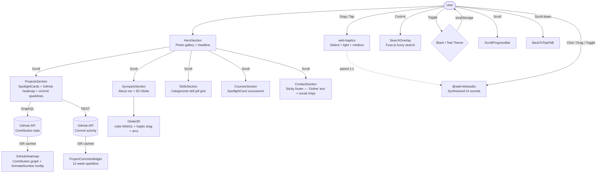
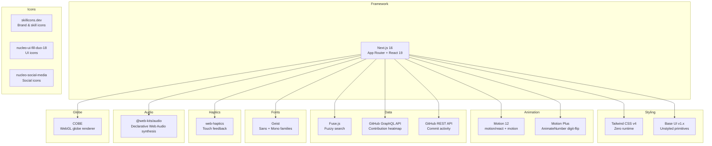

# *Portfolio Template* project

This is a portfolio I built with **Next.js 16**, **Base UI**, **Tailwind CSS v4**, and **Motion**. It has a single-page layout with a photo gallery hero, an interactive globe, a GitHub contribution heatmap, and fuzzy search. One file, `portfolio.config.ts`, controls all site content.

## Architecture


```mermaid
flowchart TB
    USER([User]) --> HERO["HeroSection<br/>Photo gallery + headline"]
    HERO --> |Scroll| SYNOPSIS["SynopsisSection<br/>About me + 3D Globe"]
    HERO --> |Scroll| PROJECTS["ProjectsSection<br/>SpotlightCards + GitHub heatmap + commit sparklines"]
    HERO --> |Scroll| SKILLS["SkillsSection<br/>Categorized skill pill grid"]
    HERO --> |Scroll| COURSES["CoursesSection<br/>SpotlightCard coursework"]
    HERO --> |Scroll| CONTACT["ContactSection<br/>Sticky footer — 'Online' text + social chips"]

    HAPTICS -.->|paired 1:1| AUDIO

    USER --> |Cmd+K| SEARCH["SearchOverlay<br/>Fuse.js fuzzy search"]

    PROJECTS --> |GraphQL| GITHUB[("GitHub API<br/>Contribution data")]
    GITHUB --> |ISR cached| HEATMAP["GitHubHeatmap<br/>Contribution graph + AnimateNumber tooltip"]
    PROJECTS --> |REST| GHREST[("GitHub API<br/>Commit activity")]
    GHREST --> |ISR cached| COMMITS["ProjectCommitsWidget<br/>12-week sparkline"]

    SYNOPSIS --> GLOBE["Globe3D<br/>cobe WebGL + haptic drag + arcs"]

    USER --> |Toggle| THEME{"Black / Teal Theme"}
    THEME --> |localStorage| USER

    USER --> |Drag / Tap| HAPTICS["web-haptics<br/>Detent + light + medium"]
    USER --> |Click / Drag / Toggle| AUDIO["@web-kits/audio<br/>Synthesized UI sounds"]

    USER --> |Scroll| PROGRESS["ScrollProgressBar"]
    USER --> |Scroll down| FAB["BackToTopFAB"]
```

## Features

- **Config-driven**: One file, `portfolio.config.ts`, drives all site content.
- **Photo gallery hero**: A desktop fanned layout shows spring arc tooltips on photos. A mobile swipeable card stack plays staggered entrance animations.
- **Interactive 3D globe**: A `cobe` WebGL globe sits in the about section. It supports drag rotation, haptic detents every ~15°, arc curves between markers, and distance labels. The arc colors follow the active theme.
- **GitHub heatmap**: A contribution graph shows year navigation, `AnimateNumber` digit-flip tooltips, and a distance-based spring ripple from the top-left. The GitHub GraphQL API feeds the data with ISR caching. A placeholder appears when you set no token.
- **Fuzzy search overlay**: Press Cmd+K or Ctrl+K to open a Fuse.js search across all sections. Search returns action links. Tags index separately from display text.
- **Project drag carousel**: A horizontal drag-to-scroll carousel uses momentum with pure pointer events. It uses no animation library. Cards are `<a>` links with native link drag suppression.
- **Project commit sparklines**: Per-project GitHub commit activity shows the last 12 weeks.
- **2 color themes**: Black and Teal themes switch through a chip-style text button. The switch uses an opacity and blur crossfade (250ms ease-out). It also uses a diagonal wipe transition (View Transitions API with clip-path, 0.7s, direction-aware keyframes). The toggle includes haptic and audio feedback. An anti-FOUC inline script prevents theme flash on load.
- **Scroll progress bar + Back-to-top FAB**: Feature flags toggle the scroll progress bar and the back-to-top button.
- **Categorized skill pills**: A categorized grid of theme-aware pills shows the tech stack. The pills use hover effects and skillicons.dev CDN icons. An inline stack description paragraph includes embedded pill buttons. `@lisse/react` smoothCorners makes squircle corners.
- **Sticky footer contact**: Pure CSS sticky reveal lets content sections scroll over with `z-10`. The Contact section sits at `z-0`, pinned to the viewport bottom. Decorative "God bless you." text sits at the bottom edge.
- **SpotlightCard**: A radial-gradient glow follows the cursor on project and coursework cards. The accent color adapts to the active theme.
- **Shadow elevation**: A two-tier depth system uses `dm-elevation-2` for dark sections. Light sections use a 3-layer stacked shadow, `elevation-2`.
- **Variant-aware typography**: `SectionWrapper` shares a React context. `Overline` and `SectionHeading` adapt their color to dark or light backgrounds. This keeps WCAG AA contrast on every section.
- **Chip-style buttons**: Squircle-cornered (`@lisse/react`) interactive chips handle nav, contact, and back-to-top actions. An animated rainbow glow ring appears on the search overlay trigger. Colors adapt to the active theme.
- **Web haptics**: Touch feedback works on chips, drags, globe rotation, and button taps.
- **Synthesized audio**: Dual-channel haptic and sound feedback accompanies every interaction. Ultra-subtle sine-wave tones from `@web-kits/audio` Minimal patch (9 sounds across 10 components) make the audio. The system auto-respects `prefers-reduced-motion`.
- **Themed scrollbar**: A thin accent-colored scrollbar stays consistent across all scroll containers.
- **Map pin avatars**: SVG map pin markers on the globe embed photos. They counter-rotate and tilt during drag.
- **Motion-optimized**: 83% of 28 animations are S or A-tier with zero layout thrashing. Standardized hover easing (ease-out-cubic) runs across Chip, ShowMoreButton, and TagPill. Theme crossfade tunes to 350ms, within the 400ms page-transition ceiling. Carousel momentum uses native browser `scrollTo`.
- **Accessible**: A skip-to-content link, semantic HTML, keyboard navigation, and `prefers-reduced-motion` support improve accessibility. Dark-section overline contrast passes WCAG AA (4.58:1).
- **SEO**: Open Graph tags, JSON-LD Person schema, and semantic heading hierarchy handle SEO.
- **Performance**: Static generation, Geist font family via `next/font`, and Tailwind v4 deliver performance.

## Tech Stack


```mermaid
graph TD
    subgraph Framework
        NEXT["Next.js 16<br/>App Router + React 19"]
    end

    subgraph Styling
        TW["Tailwind CSS v4<br/>Zero runtime"]
        BASEUI["Base UI v1.x<br/>Unstyled primitives"]
    end

    subgraph Animation
        FM["Motion 12<br/>motion/react + motion"] 
        FMP["Motion Plus<br/>AnimateNumber digit-flip"]
    end

    subgraph Data
        FUSE["Fuse.js<br/>Fuzzy search"]
        GHAPI["GitHub GraphQL API<br/>Contribution heatmap"]
        GHREST["GitHub REST API<br/>Commit activity"]
    end

    subgraph Fonts
        GEIST["Geist<br/>Sans + Mono families"]
    end

    subgraph Icons
        SKILL["skillicons.dev<br/>Brand & skill icons"]
        NUCLEO["nucleo-ui-fill-duo-18<br/>UI icons"]
        NUCSOCIAL["nucleo-social-media<br/>Social icons"]
    end

    subgraph Haptics
        WH["web-haptics<br/>Touch feedback"]
    end

    subgraph Audio
        WKA["@web-kits/audio<br/>Declarative Web Audio synthesis"]
    end

    subgraph Globe
        COBE["COBE<br/>WebGL globe renderer"]
    end

    NEXT --> TW
    NEXT --> BASEUI
    NEXT --> FM
    NEXT --> FMP
    NEXT --> FUSE
    NEXT --> GHAPI
    NEXT --> GHREST
    NEXT --> GEIST
    NEXT --> WH
    NEXT --> WKA
    NEXT --> COBE
```

| Dependency | Purpose |
|---|---|
| [Next.js 16](https://nextjs.org/) | App Router framework with React 19 |
| [Base UI](https://base-ui.com/) | Unstyled, accessible UI primitives |
| [Tailwind CSS v4](https://tailwindcss.com/) | Utility-first styling |
| [Motion 12](https://motion.dev/) | Spring animations from `motion/react` + `motion` for vanilla scroll utility |
| [Motion Plus](https://motion.dev/) | `AnimateNumber` for animated digit-flip counters |
| [Fuse.js](https://www.fusejs.io/) | Client-side fuzzy search |
| [Geist](https://vercel.com/font) | Sans and Mono font families via the `geist` package and `next/font` |
| [skillicons.dev](https://skillicons.dev/) | CDN brand icons for skill pills, theme toggle, and GitHub logo |
| [web-haptics](https://haptics.lochie.me/) | Touch haptic feedback |
| [@web-kits/audio](https://audio.raphaelsalaja.com/) | Declarative Web Audio synthesis for UI sound feedback |
| [COBE](https://cobe.vercel.app/) | WebGL globe renderer |
| [@lisse/react](https://www.npmjs.com/package/@lisse/react) | Figma-style squircle corners (Chip, ThemeToggle, SpotlightCard, CardStack) |
| [nucleo-social-media](https://www.npmjs.com/package/nucleo-social-media) | Social media icon SVGs (used in ContactSection chips) |
| [nucleo-ui-fill-duo-18](https://www.npmjs.com/package/nucleo-ui-fill-duo-18) | UI icon set for chip decorations |
| [interface-kit](https://www.npmjs.com/package/interface-kit) | Dev-mode UI inspection panel (InterfaceKit, dev only) |
| [vitest](https://vitest.dev/) + [Testing Library](https://testing-library.com/) | Unit and component testing |
| Vercel | Recommended hosting with ISR support |

## <a name="credits">Acknowledgment</a>

These open-source projects made this project possible:

- Haptic feedback from [web-haptics](https://haptics.lochie.me/)
- UI sound synthesis from [@web-kits/audio](https://audio.raphaelsalaja.com/)
- Fuzzy search from [Fuse.js](https://www.fusejs.io/)
- Accessible UI primitives from [Base UI](https://base-ui.com/)
- Clipped WebGL globe card aesthetic from [COBE](https://cobe.vercel.app/)
- Theme toggle effect from [theme-toggle.rdsx.dev](https://theme-toggle.rdsx.dev/) using View Transition API

These websites and designs inspired this project:

- [braydoncoyer.dev](https://www.braydoncoyer.dev/): hero section gallery images display with spring-animated photo fan-out
- [anirudhkuppili.com](https://anirudhkuppili.com): layout structure, section hierarchy, color theming system, and overall visual language
- [Aceternity UI](https://ui.aceternity.com/): `ArcTooltip` animated tooltip pattern, and `SpotlightCard` cursor-following radial gradient


## Quick Start

```bash
# Clone
git clone <your-repo-url> my-portfolio
cd my-portfolio

# Install
pnpm install

# Configure edit with your info
# src/config/portfolio.config.ts

# Dev
pnpm dev

# Build
pnpm build
```

## Configuration

All content lives in [`src/config/portfolio.config.ts`](src/config/portfolio.config.ts).

| Section | Description |
|---|---|
| `meta` | Name, title, headline, description, production URL (`siteUrl`), OG image |
| `themes` | Black and Teal color definitions, default theme |
| `nav` | Navigation links (supports `external` and `download` flags) |
| `hero` | Desktop photo positions + mobile photo list |
| `sections.*` | Each section has `enabled: boolean` + content data (Contact: sticky footer outside content z-10 wrapper) |
| `features` | Toggle search overlay, scroll progress, back-to-top, GitHub heatmap |

### GitHub Heatmap

To display real contribution data, create a `.env.local` file:

```
GITHUB_TOKEN=ghp_your_personal_access_token
```

The token needs the `read:user` scope. Without a token, the app shows a placeholder heatmap.

### Images

Place images in the `public/` directory:

```
public/
├── photos/          # Hero gallery photos
├── og.png           # Open Graph image (1200×630 recommended)
├── resume.docx      # Downloadable resume (DOCX)
├── resume.html      # Web-rendered resume
└── favicon.ico
```

Hero photos use `next/image` with `fill` layout for native lazy loading and zero layout shift.

## Project Structure

```
.
├── src/
│   ├── app/
│   │   ├── layout.tsx              # Root layout, fonts, theme init, JSON-LD, metadata API
│   │   ├── page.tsx                # Single page: conditionally renders sections from config
│   │   ├── robots.ts               # robots.txt metadata route
│   │   ├── sitemap.ts              # sitemap.xml metadata route
│   │   └── globals.css             # Tailwind v4 + CSS custom properties + scrollbar
│   ├── components/
│   │   ├── providers/
│   │   │   ├── AudioProvider.tsx     # Audio context + localStorage persistence
│   │   │   ├── ThemeProvider.tsx     # Theme context + localStorage sync
│   │   │   └── ThemeScript.tsx       # Inline script for flash-free theme init
│   │   ├── sections/
│   │   │   ├── HeroSection.tsx                 # Photo gallery + headline + stagger entrance
│   │   │   ├── SynopsisSection.tsx             # About + GitHub heatmap + globe
│   │   │   ├── ProjectsSection.tsx             # SpotlightCard project cards
│   │   │   ├── SkillsSection.tsx               # Categorized pill grid with skillicons.dev CDN
│   │   │   ├── CoursesSection.tsx              # SpotlightCard coursework
│   │   │   ├── CourseShowMoreClient.tsx        # Client expand/collapse with staggered entrance
│   │   │   └── ContactSection.tsx              # Social link Chips with nucleo icons
│   │   └── ui/
│   │       ├── ArcTooltip.tsx           # Spring-animated arc tooltip for photo labels
│   │       ├── BackToTopFAB.tsx         # Floating action button (dm-elevation-2, spring press)
│   │       ├── CardStack.tsx            # Mobile: swipeable photo card stack with 3D tilt
│   │       ├── Chip.tsx                 # Tag / link chip (squircle corners + dm-elevation-2)
│   │       ├── SkylineBackground.tsx # Background image for contact section
│   │       ├── GitHubHeatmap.tsx        # Contribution graph (theme-aware SVG + AnimateNumber tooltip)
│   │       ├── Globe3D.tsx              # cobe WebGL interactive globe with haptic drag detents
│   │       ├── GlobeCard.tsx            # Clipped globe card wrapper (dynamic import + skeleton)
│   │       ├── MapPinAvatar.tsx         # SVG map pin marker with embedded photo
│   │       ├── Photo.tsx                # Single draggable photo with ArcTooltip
│   │       ├── PhotoGallery.tsx         # Desktop: staggered spring photo fan-out
│   │       ├── ProjectCommitsWidget.tsx # Per-project GitHub commit sparkline
│   │       ├── ProjectDragCarousel.tsx  # Drag carousel with momentum
│   │       ├── ScrollProgressBar.tsx    # Fixed top scroll indicator
│   │       ├── SearchOverlay.tsx        # Cmd+K fuzzy search (Fuse.js + Base UI Dialog)
│   │       ├── TagPill.tsx              # Theme-aware skill pill with skillicons.dev CDN icon
│   │       ├── SectionWrapper.tsx       # Shared section layout
│   │       ├── ShowMoreButton.tsx       # Expand/collapse toggle button
│   │       ├── SpotlightCard.tsx        # Polymorphic card with cursor-following radial glow
│   │       ├── StaggeredBlurText.tsx    # Staggered word-by-word blur entrance animation
│   │       └── ThemeToggle.tsx          # Theme switcher: chip-style text button + View Transitions API diagonal wipe (0.7s)
│   ├── config/
│   │   └── portfolio.config.ts     # Single-file site configuration
│   ├── lib/
│   |   ├── clock.ts               # Realtime clock helpers
│   |   ├── color.ts               # Color manipulation utilities
│   |   ├── github.ts              # GitHub GraphQL client
│   |   ├── scroll.ts              # Spring-animated scroll utilities
│   |   └── search.ts              # Fuse.js search index builder
│   ├── types/
│   │   └── config.ts               # TypeScript config interfaces
├── lib/
│   └── audio/
│       ├── index.ts               # @web-kits/audio generated patch
│       └── minimal.ts             # Minimal audio patch reference
└── public/
    ├── photos/                     # Hero gallery images
    ├── og.png                      # Open Graph image (1200×630)
    ├── resume.docx                 # Downloadable resume
    └── resume.html                 # Web-rendered resume
```

## Deployment

Deploy to Vercel:

```bash
pnpm dlx vercel
```

Or build and serve statically:

```bash
pnpm build
pnpm start
```

## License

MIT
