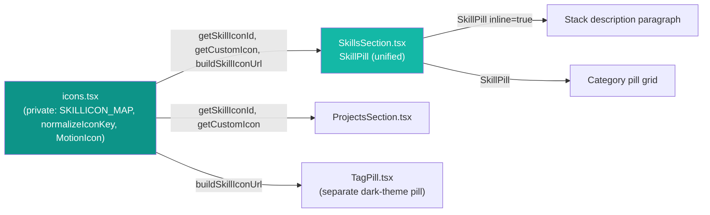

# Pill System Consolidation & Icon Module Cleanup

Refactoring pass to remove unused exports from `icons.tsx` and eliminate duplicate pill components in `SkillsSection.tsx`.

## Overview

Two code-quality improvements applied to the skill pill rendering system:

1. **`icons.tsx`** — Three exports were only used internally; now properly scoped as private.
2. **`SkillsSection.tsx`** — `InlinePill` and `SkillPill` shared identical logic except a single CSS class; merged into one component with an `inline` prop.

No behavioral changes. No visual changes.

---

## Implementation Details

### 1. icons.tsx — Export Cleanup

**Before:** 5 public exports (`SKILLICON_MAP`, `buildSkillIconUrl`, `normalizeIconKey`, `getSkillIconId`, `MotionIcon`, `getCustomIcon`)

**After:** 3 public exports (`buildSkillIconUrl`, `getSkillIconId`, `getCustomIcon`)

Three symbols were only consumed internally within the same module:

| Symbol | Used by | Action |
|--------|---------|--------|
| `SKILLICON_MAP` | `getSkillIconId` (line 45) | Changed from `export const` → `const` |
| `normalizeIconKey` | `getSkillIconId`, `getCustomIcon` | Changed from `export function` → `function` |
| `MotionIcon` | `getCustomIcon` (line 65) | Changed from `export function` → `function` |

**Public API surface (unchanged):**

```ts
export function buildSkillIconUrl(iconId: string, theme: "light" | "dark"): string
export function getSkillIconId(key: string): string | null
export function getCustomIcon(key: string): ReactNode | null
```

**Consumers across the codebase:**

| Consumer | Imports |
|----------|---------|
| `SkillsSection.tsx` | `getSkillIconId`, `getCustomIcon`, `buildSkillIconUrl` |
| `ProjectsSection.tsx` | `getSkillIconId`, `getCustomIcon` |
| `TagPill.tsx` | `buildSkillIconUrl` |

### 2. SkillsSection.tsx — Pill Deduplication

**Before:** Two nearly identical components:

- `InlinePill` — stack description paragraph (had `mx-0.5` for inline spacing)
- `SkillPill` — category grid (no `mx-0.5`)

Both shared: same `className` (except `mx-0.5`), same `style` (150ms cubic-bezier transition), same icon resolution logic (`getSkillIconId` + `getCustomIcon` + `buildSkillIconUrl`), same `<a>` / `<span>` branching for linked vs. unlinked.

**After:** Single `SkillPill` with optional `inline` prop:

```tsx
function SkillPill({ name, icon, href, inline }: {
  name: string;
  icon?: string;
  href?: string;
  inline?: boolean;
})
```

When `inline` is `true`, prepends `mx-0.5` to the className for proper inline text spacing. All other styling and logic is shared.

**Render sites:**

```tsx
// Stack description paragraph (inline mode)
<SkillPill key={i} name={part.name} icon={part.icon} href={part.href} inline />

// Category grid (default mode)
<SkillPill key={skill.name} name={skill.name} icon={skill.icon} href={skill.href} />
```

---

## Dependencies



### Pill Component Matrix (post-consolidation)

| Component | File | Theme | Icon Source | Used In |
|-----------|------|-------|-------------|---------|
| `SkillPill` | `SkillsSection.tsx` | Light (`bg-light-bg-alt`, `elevation-2`) | skillicons.dev CDN (light) | Stack description (inline) + category grid |
| `TagPill` | `TagPill.tsx` | Dark (`bg-dark-bg-alt`, `dm-elevation-2`) | skillicons.dev CDN (dark) | Project card tags |

`TagPill` remains a separate component because it has fundamentally different styling (dark theme, different elevation, `cursor-default`, no link support).

---

## Additional Insights

### Why not merge TagPill too?

`TagPill` differs structurally from `SkillPill`:
- Always renders `<span>` (never `<a>`)
- Uses `cursor-default` (not a link or interactive element)
- Dark theme with `dm-elevation-2` (vs. light `elevation-2`)
- Uses dark-themed skillicons.dev icons
- Receives pre-resolved `iconId` + `customIcon` props (icon resolution happens in `ProjectsSection`, not in the pill)

Merging TagPill with SkillPill would require a `variant` prop and conditional rendering paths, adding more complexity than the deduplication saves.

### Audit Trail

- **Before:** `InlinePill` (47 lines) + `SkillPill` (47 lines) = 94 lines of duplicate logic
- **After:** Single `SkillPill` (48 lines)
- **Net change:** ~46 fewer lines, zero visual or behavioral changes

---

## Metadata

- **Analysis date:** 2026-06-16
- **Depth:** 2 (icons.tsx + SkillsSection.tsx + their consumers)
- **Type:** Refactor / code quality
- **Related docs:** `knowledge-portfolio-codebase.md` (Pill Design System section needs update)
